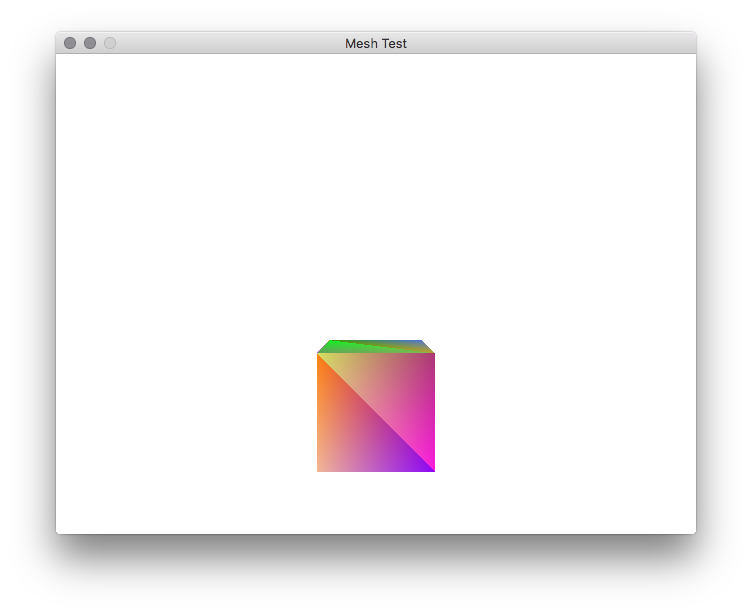

# Mesh

Mesh is a port of my Javascript 3d game engine to Go (using OpenGL 2.1). It is currently just a shell of a thing.

## Requirements

* Go 1.10 or greater
* Make
* SDL2
* A system that supports OpenGL 2.1 (Most basic Apple Macs support this)
* Homebrew (on Mac)

## Tests

    make deps
    make test

## Running

    make deps
    make start

## Running "by hand"

Install go
Install SDL2

    $ brew install sdl2{,_image,_mixer,_ttf,_gfx} pkg-config

Install go bindings for SDL2

    go get -v github.com/veandco/go-sdl2/sdl
    go get -v github.com/veandco/go-sdl2/img
    go get -v github.com/veandco/go-sdl2/mix
    go get -v github.com/veandco/go-sdl2/ttf
    go get -v github.com/veandco/go-sdl2/gfx

    or type this if you use Bash terminal:
    go get -v github.com/veandco/go-sdl2/{sdl,img,mix,ttf}

Install binding for opengl (2.1)

    go get -u github.com/go-gl/gl/v{3.2,3.3,4.1,4.2,4.3,4.4,4.5,4.6}-{core,compatibility}/gl
    go get -u github.com/go-gl/gl/v3.1/gles2
    go get -u github.com/go-gl/gl/v2.1/gl
    go get -v github.com/chsc/gogl/gl33
